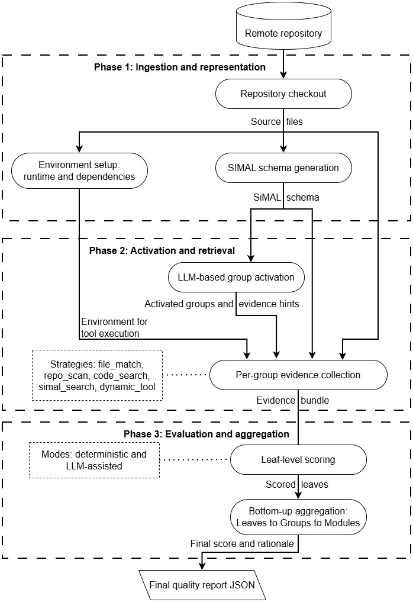

# SAGES: SiMAL-Augmented Grading Engine for Software

SAGES is a repository-quality evaluation pipeline that combines [SiMAL](https://github.com/nlpforua/simal) schema context, lightweight repository retrieval, and tool-assisted evidence to produce structured software quality assessments.



## What SAGES Does

SAGES evaluates a target repository in four stages:

1. Detect repository signals such as language mix, framework traits, and likely runtime concerns.
2. Activate only the rubric modules and groups that apply to that repository.
3. Collect evidence from SiMAL schema content, repository retrieval, file matching, and external tools.
4. Score the activated groups and aggregate them into a structured quality report.

The rubric in [nodes.yaml](nodes.yaml) spans general software quality and stack-specific concerns, including:

- repository governance and hygiene
- build, dependencies, and reproducibility
- architecture and dependency structure
- code hygiene and readability
- reliability and robustness
- performance and resource safety
- testing and testability
- security and supply chain
- operability and observability
- documentation and usability
- web/backend, data, frontend, mobile, ML, and DevOps modules

Evidence collection strategies are configured in [profiles.yaml](profiles.yaml) and include file matching, repository scans, code search, SiMAL schema search, and dynamic tool execution.

## Repository Contents

Core pipeline code:

- [main.py](main.py): end-to-end pipeline, evidence collection, activation, scoring, and CLI
- [runner.py](runner.py): importable notebook-friendly wrapper around the pipeline
- [aggregation.py](aggregation.py): rubric aggregation and final report payload assembly
- [node_prompt.py](node_prompt.py): activation prompt construction
- [scoring_prompt.py](scoring_prompt.py): evidence compaction and scoring prompt construction
- [tool_registry.py](tool_registry.py): mapping from evidence classes to executable tools
- [tool_summarizer.py](tool_summarizer.py): normalization and summarization of tool outputs
- [llm_client.py](llm_client.py) and [llm_runtime.py](llm_runtime.py): provider configuration and LLM runtime integration

Configuration and rubric assets:

- [nodes.yaml](nodes.yaml): hierarchical rubric definition
- [profiles.yaml](profiles.yaml): evidence profile definitions per group
- [llm_config.yaml](llm_config.yaml): publish-safe provider configuration using environment variables

Curated artifacts included in the repository:
- [notebooks](notebooks): exploratory and evaluation notebooks used during development and paper experiments

## Installation

SAGES currently targets Python and uses a minimal dependency set for orchestration.

```bash
python -m venv .venv
source .venv/bin/activate
pip install -r requirements.txt
```

## Configuration

The tracked [llm_config.yaml](llm_config.yaml) is intentionally publish-safe and expects credentials through environment variables.

Example environment setup:

```powershell
$env:OPENAI_API_KEY = "<your-key>"
```

Supported providers in the current config are OpenAI, Gemini, and Claude. You can override provider and model from the command line with `--llm-provider`, `--llm-model`, `--activation-model`, and `--scoring-model`.

## Running The Pipeline

### CLI

The main entry point is [main.py](main.py). At minimum, provide a repository path and an output path.

Heuristic activation only:

```bash
python main.py \
  --repo /path/to/repo \
  --heuristic-activation \
  --out quality_report.json
```

SiMAL-augmented run with tool execution:

```bash
python main.py \
  --repo /path/to/repo \
  --simal-schema /path/to/schema.txt \
  --run-tools \
  --out quality_report.json
```

Useful options from the CLI surface include:

- `--disable-simal`: force non-SiMAL mode and skip SiMAL evidence retrieval
- `--activation-json`: reuse a saved activation decision
- `--group-scores-dir`: reuse saved group scoring JSON
- `--emit-prompts-dir`: write activation and scoring prompts for inspection
- `--stop-after activation|tools|scoring`: stop after an intermediate stage while preserving work artifacts

### Notebook / Python API

For notebook workflows, use the wrapper in [runner.py](runner.py):

```python
from runner import PipelineOptions, run_pipeline

report = run_pipeline(
    PipelineOptions(
        repo=r"D:\path\to\repo",
        heuristic_activation=True,
        out="quality_report.json",
    )
)
```

## Output Artifacts

Example activation excerpt from the curated sample:

```json
{
  "normalized_languages": ["php", "javascript"],
  "inferred_repo_signals": {
    "uses_http_api": true,
    "uses_db": true,
    "uses_queue": true,
    "uses_frontend_framework": true,
    "repo_kind": "backend"
  }
}
```

Example token accounting excerpt:

```json
{
  "stages": {
    "activation": {
      "input_tokens": 13904,
      "output_tokens": 7383,
      "reasoning_tokens": 1177,
      "total_tokens": 21287
    }
  }
}
```

Example tool result excerpt from the curated sample:

```json
{
  "tool": "gitleaks",
  "status": "completed",
  "exit_code": 0,
  "tool_summary": {
    "reports": {
      "gitleaks.json": {
        "findings_total": 0
      }
    }
  }
}
```

## Notebooks

The [notebooks](notebooks) directory contains exploratory and experiment-driving notebooks used during development and evaluation. They document intermediate experiments, prompt studies, token accounting, and evaluation workflows.

## Citation And Reuse

If you use this repository in research or benchmarking work, cite the accompanying paper.
